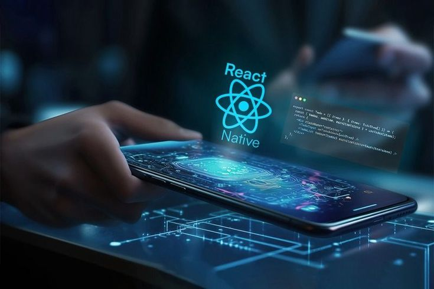

# CSK Hackathon — Mobile Development Track

## Overview

The **CSK Mobile Hackathon** is a hands-on learning and building challenge focused on mobile development using **React Native** and **Expo**.  
From **March 16 to March 27**, participants will go through a structured series of daily mini-challenges designed to help beginners learn the fundamentals of building mobile applications.

Each day follows a simple structure:

**Learn → Build → Submit**

Participants will learn a concept, apply it in a small practical challenge, and submit their solution. By the end of the hackathon, everyone should have the skills needed to build and present a complete mobile application.

This track is designed to be **beginner friendly**, but also valuable for participants who already have some programming experience.

---

## Technologies

The mobile track will primarily use:

* React Native
* Expo
* GitHub
* React Navigation
* AsyncStorage

Participants only need basic knowledge of **JavaScript or React** to get started.

---

## Hackathon Structure

The hackathon runs for **10 learning days**, followed by final project submissions.

| Day    | Topic                          |
| ------ | ------------------------------ |
| Day 1  | Setup & First React Native App |
| Day 2  | Layout and Styling             |
| Day 3  | Reusable Components            |
| Day 4  | Lists with FlatList            |
| Day 5  | Navigation                     |
| Day 6  | Forms and Inputs               |
| Day 7  | Fetching Data from APIs        |
| Day 8  | Auth with Supabase             |
| Day 9  | Localstorage                   |
| Day 10 | Final Project                  |

---

## Progress Tracker

<!-- PROGRESS:START -->
### 📊 Overall Progress

🔓 **Day 1: 🚀 Setup & First React Native App** - [Start Challenge](./challenges/day-01-setup/README.md)  
🔒 **Day 2: 🎨 Layout and Styling** - Locked  
🔒 **Day 3: 🧩 Reusable Components** - Locked  
🔒 **Day 4: 📋 Lists with FlatList** - Locked  
🔒 **Day 5: 🧭 Navigation** - Locked  
🔒 **Day 6: 🖊 Forms and Inputs** - Locked  
🔒 **Day 7: 🌐 Fetching Data from APIs** - Locked  
🔒 **Day 8: 🔐 Auth with Supabase** - Locked  
🔒 **Day 9: 💾 Localstorage** - Locked  
🔒 **Day 10: 🏆 Final Project** - Locked  

**Last completed:** None
<!-- PROGRESS:END -->

---

## Participation Workflow

1. Fork this repository.
2. Clone your fork locally.
3. Complete the daily challenge.
4. Push your solution to your fork.
5. Submit a **Pull Request** to this repository or use the **Challenge Complete issue template**.

Example pull request title:

Day 4 Challenge — Lists with FlatList Implementation
All submissions will be reviewed to track progress and participation.

---

## Submission Guidelines

To keep the process organized:

* Submit **one pull request per challenge** or an issue using the `Challenge Complete` template.
* Follow the folder structure provided in the repository.
* Ensure the project runs without errors.
* Include a short description of your solution in the PR or issue.

Optional but encouraged:

* Include a screenshot or screen recording of your app.

---

## Final Project

At the end of the challenge, participants will build a **small mobile application** using the concepts learned during the hackathon.

The final project should include:

* Multiple screens
* Navigation
* Reusable components
* A list rendered with FlatList
* Either API data or local storage
* Clean and readable styling

Example project ideas:

* Campus events app
* Notes application
* Todo manager
* Contacts list
* Habit tracker

Participants will present their final projects during the closing session.

---

## Support

If you encounter any issues:

* Ask questions in the hackathon community channel
* Check the challenge documentation for guidance
* Collaborate with other participants when possible

Mentors will be available throughout the hackathon to help participants progress.

---

## Goal

The goal of this track is not only to finish challenges, but to **build confidence in mobile development** and understand how real mobile applications are structured.

By the end of the hackathon, participants should be able to:

* Set up a React Native project
* Build user interfaces
* Create reusable components
* Work with navigation and lists
* Fetch and display data
* Build a small but complete mobile application

---

## License

This repository is provided for educational purposes as part of the CSK Major Hackathon.  
Lead: <samuel202mwangi@gmail.com>
